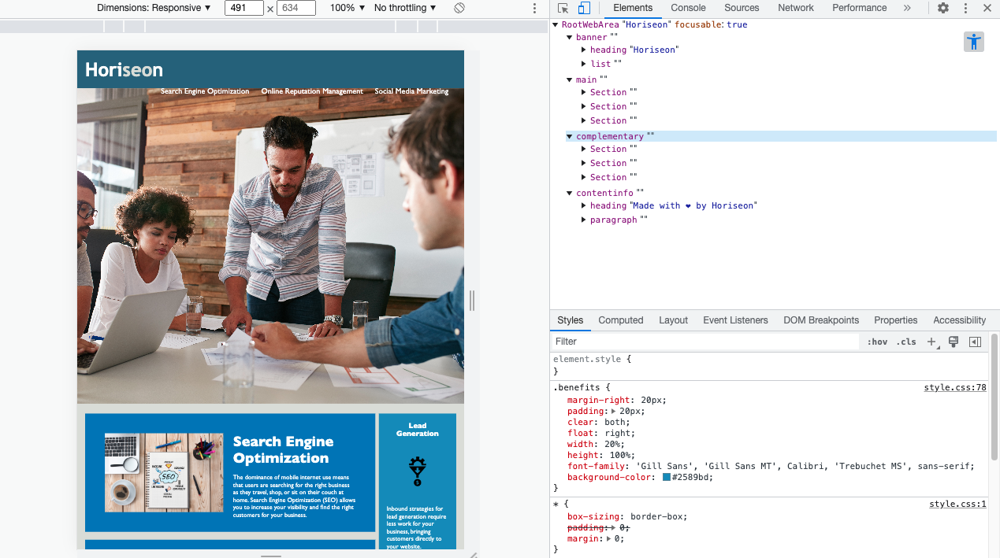

# ADA-Refactoring

## Description

I was tasked to re-factor an existing HTML to be more ADA accessible. I was provided the HTML files and added a semantic labeling (Header, Main, Section, aside, and footer.), added alt tags for images, and cleaned up as I coded (making sure everything in the NAV bar what is the selectable for readers). Added the title section and easier to read spacing for coding and future upkeep for the site. 

The changes I added to the HTML will fallow ADA best practices and accessibility standards.

I learned the basics of ADA and WCAG, semantic labeling, ID & Class tags, and Elements. 

## Installation

N/A

## Usage

Provide instructions and examples for use. Include screenshots as needed.

Vist the site and inspect the site unsing Devtools, [Horiseon Link Here](https://link-url-here.org). Upon inspection, one should see the HTML in an easy to read format. If using an accessibility view, you should see the accessible Nav links and paragraphs. 

## Credits

ADA References,
[Deque University](https://dequeuniversity.com/rules/axe/4.6/image-alt?application=axe-linter)

## License

N/A